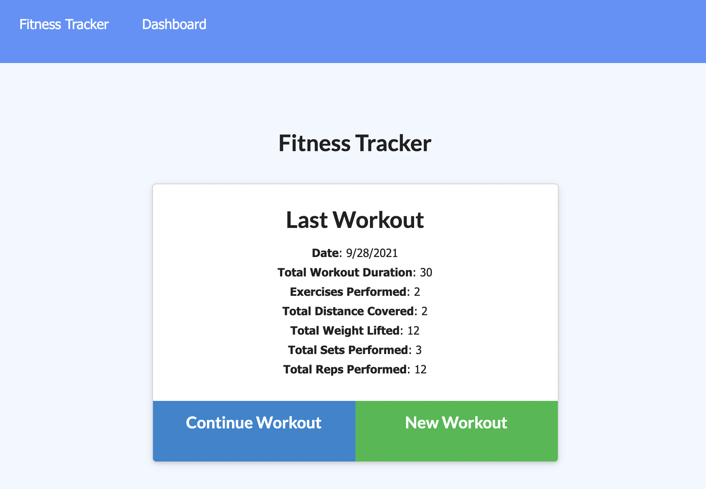

# Workout-Tracker-HW 

## Description

The purpose of this app is to be able to record a workout each day. The workout can have multiple exercises, either with a name of 'cardio' or 'resistance.' Both cardio and resistance have other input fields that would be recorded with those workout types.

## Table of Contents

- [Installation](#installation)
- [Usage](#usage)
- [Assets](#assets)
- [License](#license)
- [GitHub Profile](#github-profile)
- [Contact by Email](#email)

## Installation

Run npm i to install necessary libraries.

## Usage

Workouts are associated with the current date, so everytime an exercise is added, the current date is received.

## Assets

## License

This project is licensed with MIT.

### GitHub Profile

[My Profile](https://github.com/audrey-g37)

### Email

audrey.gillies@gmail.com
